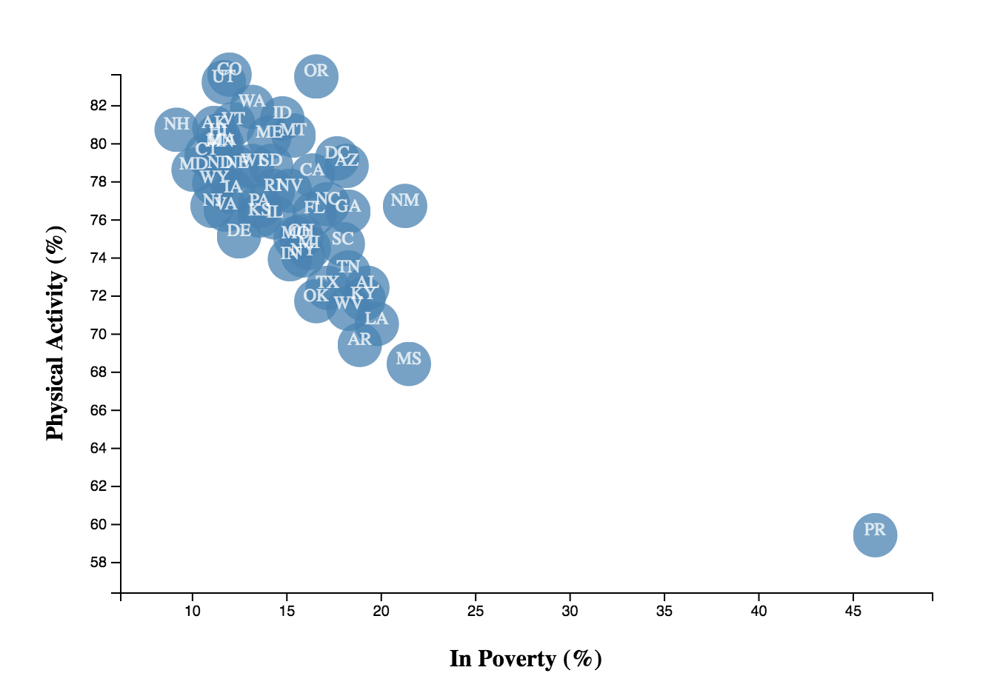

## Is There A Correlation Between Percent in Poverty and Physical Activity?
- This Assignment was created using D3 (the JavaScript library for visualizing data), HTML, SVG, and CSS.

- We used Data Driven Document(D3) to explore certain associations between demographic and behavioral risk factors using survey data collected from the U.S Census Bureau's American Community Survey(ACS) and the Behavioral Risk Factor Surveillance System(BRFSS) during the year of 2014. Each marker represents an individual state in United States.

Let's take a look of the bubble chart! 

You can explore more here: https://weekysui.github.io/data_journal/

